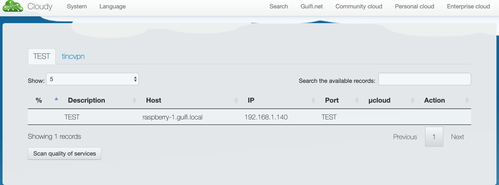

# cloudylab-serf

Firstly, I'm going to describe what is cloudy, [Cloudy](http://cloudy.community/) is a distribution based on Debian GNU/Linux, aimed at end users, to foster the transition and adoption of the Community Network cloud environment.

# How it works

Cloudy use [Serf](https://www.serf.io/)  in order to add or delete nodes from Cloudy.

# What am I going to do? 

- Transform 4 raspberrys pi on Cloudy distro [Cloudyning](https://github.com/Clommunity/cloudynitzar) these.
- Use 1 raspberry as Bootsrap Server.
- Join the other raspberrys to cluster.
- Check the resilence.
- Expose services and watch how Serf through [gossip](https://www.serf.io/docs/internals/gossip.html) will be able to communicate the changes to other nodes. 

# Let's do it 
## 1- Cloudynizing raspberrys:
```sh
sudo apt-get update; sudo apt-get install -y curl lsb-release
curl -k https://raw.githubusercontent.com/Clommunity/cloudynitzar/master/cloudynitzar.sh |sudo  bash -
```
- When the process is finished you will be able to connect to 127.0.0.1:7000
```sh
cloudy:~$ nc -zv 127.0.0.1 7000
Connection to 127.0.0.1 7000 port [tcp/afs3-fileserver] succeeded!
```

- You can check it in your navigator and you shoud watch something like:


## 2- Playing with Serf

As I said before, Cloudy use Serf in order to get Failure detection, Service Discovery with Gossip and Custom Events.

- Firs of all, I put the first member of the cluster as Bootsrap Server.

```sh
pi@raspberrypi:~ $ serf agent -bind=192.168.1.141
==> Starting Serf agent...
==> Starting Serf agent RPC...
==> Serf agent running!
         Node name: 'raspberrypi'
         Bind addr: '192.168.1.141:7946'
          RPC addr: '127.0.0.1:7373'
         Encrypted: false
          Snapshot: false
           Profile: lan

==> Log data will now stream in as it occurs:

    2019/03/09 16:46:57 [INFO] agent: Serf agent starting
    2019/03/09 16:46:57 [INFO] serf: EventMemberJoin: raspberrypi 192.168.1.141
    2019/03/09 16:46:58 [INFO] agent: Received event: member-join
    2019/03/09 16:50:02 [INFO] agent.ipc: Accepted client: 127.0.0.1:41974
    2019/03/09 16:50:02 [INFO] serf: EventMemberUpdate: raspberrypi
    2019/03/09 16:50:03 [INFO] agent: Received event: member-update
```

Then, I can see the node inside the cluster:

```sh
pi@raspberrypi:~ $ serf members
raspberrypi  192.168.1.141:7946  alive  
```

- Joining more nodes to cluster:

```sh
pi@raspberry-1:~ $ serf agent -join=192.168.1.141 -bind=192.168.1.140
==> Starting Serf agent...
==> Starting Serf agent RPC...
==> Serf agent running!
         Node name: 'raspberry-1'
         Bind addr: '192.168.1.140:7946'
          RPC addr: '127.0.0.1:7373'
         Encrypted: false
          Snapshot: false
           Profile: lan
==> Joining cluster...(replay: false)
    Join completed. Synced with 1 initial agents

==> Log data will now stream in as it occurs:

    2019/03/09 17:05:36 [INFO] agent: Serf agent starting
    2019/03/09 17:05:36 [INFO] serf: EventMemberJoin: raspberry-1 192.168.1.140
    2019/03/09 17:05:36 [INFO] agent: joining: [192.168.1.141] replay: false
    2019/03/09 17:05:36 [INFO] serf: EventMemberJoin: raspberrypi 192.168.1.141
    2019/03/09 17:05:36 [INFO] agent: joined: 1 nodes
    2019/03/09 17:05:37 [INFO] agent: Received event: member-join
```
**NOTE:** You can see the flag -join in the command, that is the reference to bootstrap server (you could do it from config files too).

```sh
pi@raspberrypi:~ $ serf members
raspberrypi  192.168.1.141:7946  alive
raspberry-1  192.168.1.140:7946  alive
```

- I added the last one: 

```sh
pi@raspberrypi:~ $ serf members
raspberrypi  192.168.1.141:7946  alive
raspberry-1  192.168.1.140:7946  alive
raspberry-1  192.168.1.143:7946  alive
```

Before to start to add services I want to test the cluster's resilence.

- I'm going to stop the node which role is bootstrap server.

```sh
    2019/03/10 09:50:30 [INFO] agent: Received event: member-update
^C==> Caught signal: interrupt
==> Gracefully shutting down agent...
    2019/03/10 09:59:41 [INFO] agent: requesting graceful leave from Serf
    2019/03/10 09:59:42 [INFO] serf: EventMemberLeave: raspberrypi 192.168.1.141
    2019/03/10 09:59:42 [INFO] agent: requesting serf shutdown
    2019/03/10 09:59:42 [INFO] agent: shutdown complete
```

- I can see how the node has sent a new event "member-leave" to cluster.

```sh
    2019/03/10 09:59:42 [INFO] serf: EventMemberLeave: raspberrypi 192.168.1.141
    2019/03/10 09:59:43 [INFO] agent: Received event: member-leave
```

- Watching members status again:

```sh
pi@raspberry-1:~ $ serf members
raspberrypi  192.168.1.141:7946  left
raspberry-1  192.168.1.140:7946  alive
raspberry-1  192.168.1.143:7946  alive
```

- Addding again the node to whichever 2 nodes with status alive.

```sh
pi@raspberrypi:~ $ serf agent -bind=192.168.1.141 -join 192.168.1.140
```

```sh
pi@raspberry-1:~ $ serf members
raspberrypi  192.168.1.141:7946  alive
raspberrypi  192.168.1.140:7946  alive
raspberrypi  192.168.1.143:7946  alive
```

**AWESOME:** While a node keep alive, you can add as nodes as you want.


## 3- Expoxing services through Serf and Cloudy

Thanks to Cloudy and using [avahi-ps script](https://github.com/Clommunity/avahi-ps/blob/master/avahi-ps) I can publish or unpublish service through Serf:

```sh
pi@raspberrypi:~ $ avahi-ps
avahi-ps (Avahi Publish and Search) is a system to publish local services and
discover remote ones using Avahi and other available modules plugged-in.

Usage: /usr/sbin/avahi-ps publish|unpublish|search|info <options>

Examples:

 - Publishing a local service to the network:
   /usr/sbin/avahi-ps publish <description> <type> <port> [txt]
      <description>: a short text describing the service
      <type>: service type
      <port>: service port
      <txt>: additional information, formatted as
                'attribute1=value1&attribute2=value2&...&attributeN=valueN'

 - Unpublishing a local service to the network
   /usr/sbin/avahi-ps unpublish [type] [port]

 - Searching for services on the network:
   /usr/sbin/avahi-ps search [type] [hostname]

 - Showing available information:
   /usr/sbin/avahi-ps info <variable>
       <variable>: ip|cloud|tincdev|communitydev
```

This script is calling to [avahi-ps-serf](https://github.com/Clommunity/package-serf/blob/master/usr/share/avahi-ps/plugs/avahi-ps-serf) [adding, searching and deleting tags](https://www.serf.io/docs/commands/tags.html), it's how Cloudy exposes and propagate services to other nodes.

- I'm going to publish a new service called TEST:

```sh
pi@raspberry-1:/etc/init.d $ /usr/sbin/avahi-ps publish TEST TEST TEST TEST
Successfully updated agent tags
```

- Cluster gets the new event:

```sh
2019/03/10 11:13:22 [INFO] serf: EventMemberUpdate: raspberry-1
2019/03/10 11:13:23 [INFO] agent: Received event: member-update
```

- And now the command `serf members` looks like:

```sh
pi@raspberry-1:/etc/init.d $ serf members
raspberry-2  192.168.1.143:7946  alive  services=QlpoOTFBWSZTWfn5OQ0AABtfgAAQEAcTEAABTQq/p98qIABBEaTNTRoADT1GgxDGExNBgjEMjCZc1Bt4MgWb/IGXhWoBMhGpCJZOxzBYAGrzVDafCo5vimkNvb+qPpelFkCc0O1dTFl4tMWJnkyU1/i7kinChIfPycho
raspberry-1  192.168.1.140:7946  alive  services=QlpoOTFBWSZTWWfzP3wAAEdfgAAQEAd3cAIBTQq/p98qIACSCVU2h6kwATAQbII9T0EoVNGmT0jIaNqabQE0MU807XzNcXs4kI0gZ4GWa4RLKRRoTiCmgw0rlBNdT0eSoU6Dx48UJCs4FZuYYUYRHBC6AMWCdjhdrHxp6GNHu4fPpgXEB+P54iaIbxE0ZyPmw5QhUKIxahHnFqGG7kOhdyRThQkGfzP3wA==
raspberrypi  192.168.1.141:7946  alive  services=QlpoOTFBWSZTWYyBIrAAACDfgAAQEAU3cAABTQq/p98qIAB0KmamNQAaA00NGmj1CE1DTTTIDTQD1BoCxgGvU1qSGcNuDVCWkQR6RLEbmWzg5wpel4RESCEcNtwe0nBHN0TiZsGXyr89gMVvEZjdByRAu5E6UKOTFfEn8XckU4UJCMgSKwA=
```

- The tag is encrypted in base64, I can see what is happening with:

```sh
echo "QlpoOTFBWSZTWRYvUqQAAEdfgAAQEAd3cAIBTQq/p98qIACSCVRoeoCYmTAmRtEw1PQShUyaY1DTQNqaPUzSYmmnXgnO/e1xezicmSBlE+ZLGRaCSZCoQU/DDOpQTXU8HcsFOI8ePFCctNpabGGFGERwQugEVgjhuuvV4YZmrB2IPvJcWD50fz1CwQ/Qk0ZwPGw1QhSKIxahHWlaFzd0OxdyRThQkBYvUqQ="|base64 -d - |bunzip2 -
[{"s":"TEST","d":"TEST","m":"raspberry-1.guifi.local","i":"192.168.1.140","p":"TEST","e":"","t":"TEST"},{"s":"tincvpn","d":"TincVPN_System","m":"raspberry-1.guifi.local","i":"192.168.1.140","p":"665","e":"","t":""}]
```

- Or easier than before, I can check services exposed from Cloudy:



- I want to comment that you could expose services from Cloudy console but there are really limited.

# Conclusion:

At this point, I can say that Cloudy and Serf works very well together, with Serf we have decentralized cluster membership, failure detection, and orchestration, and Cloudy is a little wrapper who is making easier our life.

On the other hand, currently Cloudy doesn't have a huge list of services so, you should to use terminal in order to add more services to your microcloud or your community cloud.

